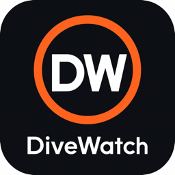
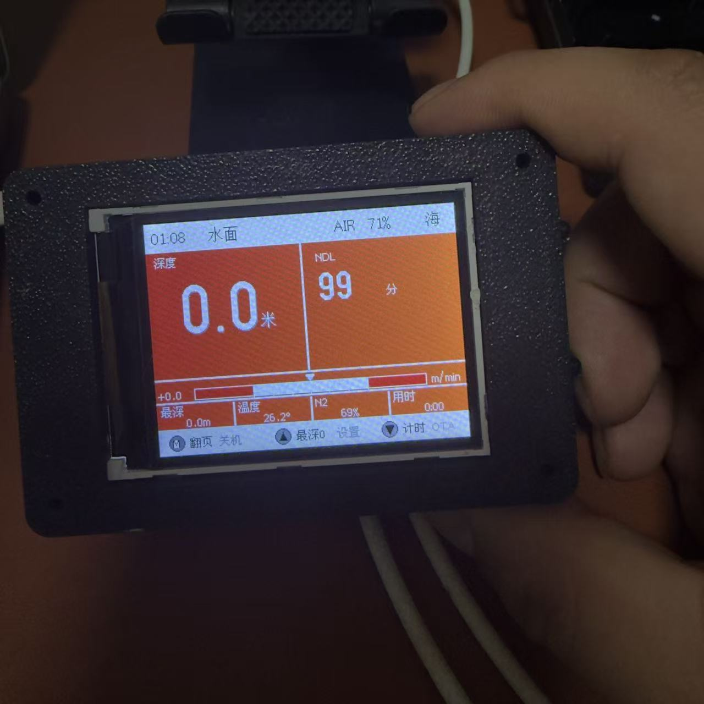
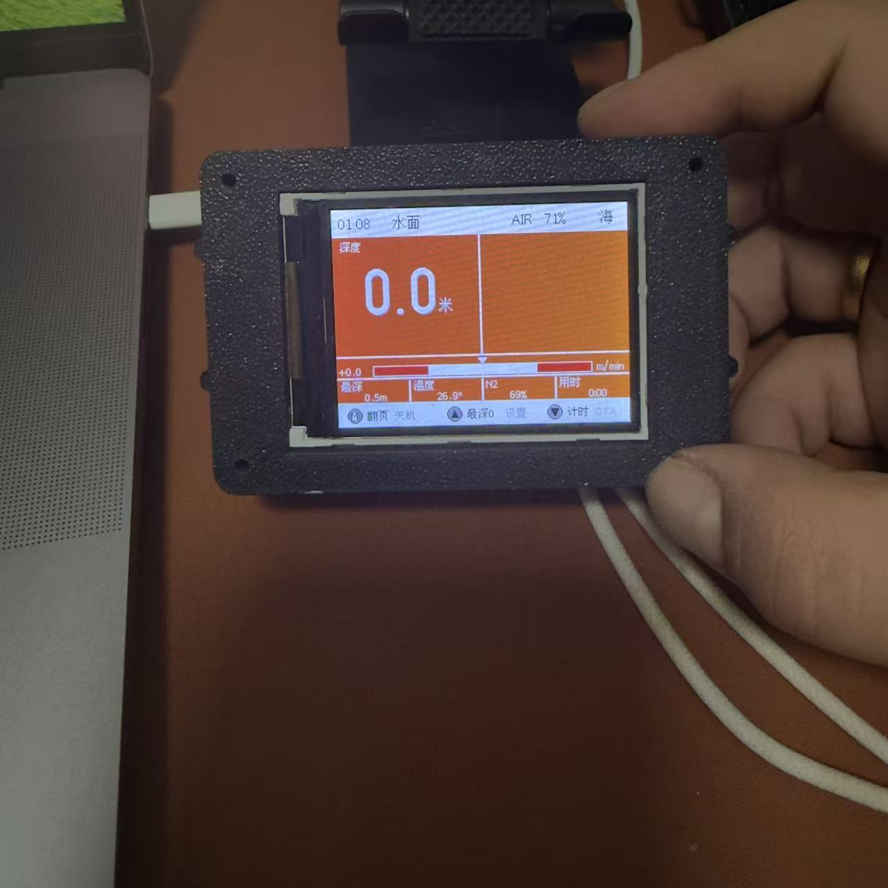
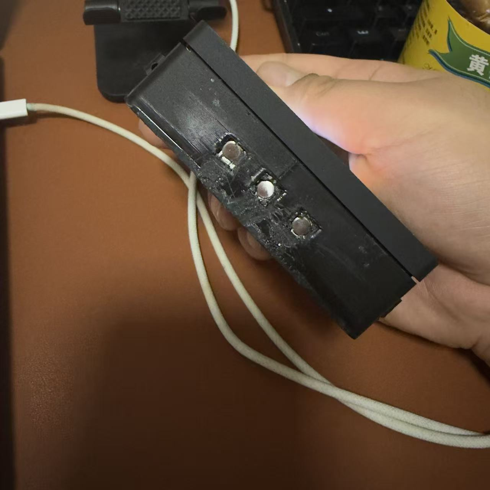
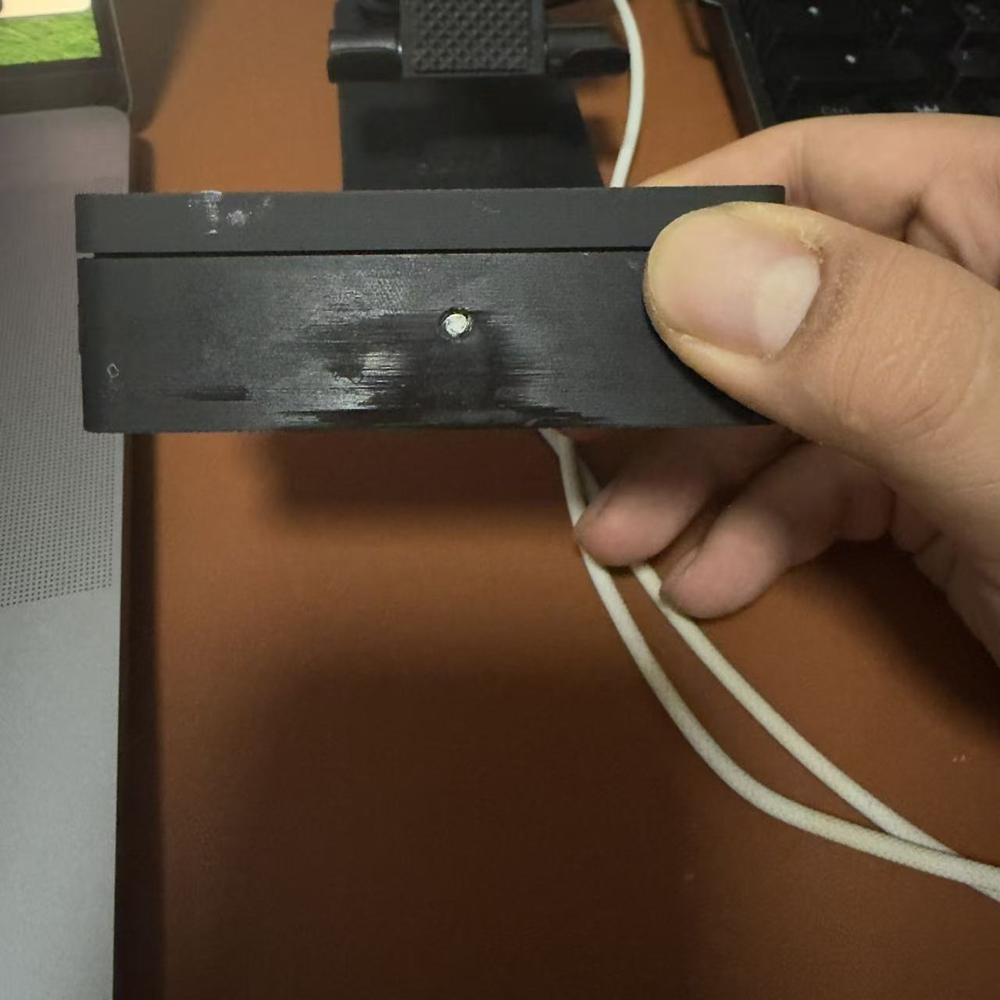

<p align="center">
  
</p>

<h1 align="center">DiveWatch</h1>

<p align="center">
  <b>Open-source DIY dive computer</b> · ESP32-S3 + ST7789 + MS5837<br/>
  Complete project: <b>Firmware + 3D Case + Android App</b>
</p>

<p align="center">
  <a href="README.md">中文</a> ·
  <a href="README.en.md">English</a> ·
  <a href="LICENSE">MIT License</a>
</p>

<p align="center">
  
  
</p>
<p align="center">
  
  
</p>

---

> ⚠ **For educational and recreational use only. NOT certified for life-critical applications. Always carry a certified dive computer or dive tables as your primary planning tool when diving.**

## Features

- **Garmin Descent X50i style HUD** — 11 data pages + full-screen alarms + dive enter/exit screens
- **Bühlmann ZHL-16C decompression** — 16 tissue compartments + altitude correction + conservatism factor
- **AOW safety stop** — 2.5-6m window, accumulated timing, 30s jitter tolerance
- **Brick-proof OTA** — BLE configures WiFi → WiFi OTA with dual-slot auto-rollback
- **Ultra-low power** — Light Sleep ~5mA / Deep Sleep ~10μA
- **Complete 3D printed case** — resin bottom + resin top + TPU bumper
- **Android app** — flat-design BLE WiFi setup + WiFi OTA + local dive log

## Repository layout

```
watcher/
├── arduino/DiveWatch_v4/    # Firmware (~3400 lines .ino + BLE OTA module)
├── case_v5/                 # 3D case source (build123d Python)
├── case/                    # 3D case artifacts (.step / .stl / .3mf)
├── android_app/             # Android app (Capacitor 7 + Vanilla JS)
├── assets/                  # Image assets
├── PINOUT.md                # ESP32-S3 pin map
├── HARDWARE.md              # BOM + wiring
└── README.md / README.en.md
```

## Hardware

| Component | Model | Wiring |
|---|---|---|
| MCU | ESP32-S3-Nano (4 MB Flash / 8 MB PSRAM) | — |
| Display | ST7789 2.4" SPI 240×320 | CS=21 / DC=18 / RST=17 / MOSI=38 / SCK=48 / BL=8 |
| Pressure sensor | MS5837-30BA | I²C SDA=11 / SCL=12 (addr 0x76) |
| Buttons | 3 × 6×6 SMT | MODE=6 / UP=7 / DOWN=10 |
| Buzzer | 9042 + S8050 NPN | GPIO 5 via 1kΩ → transistor base |
| Battery monitor | 2:1 divider (10K+10K recommended) | ADC A0 = GPIO 1 |
| Wireless charging | Qi 5V/1A receiver + TP4056 | see [HARDWARE.md](HARDWARE.md) |

Full pinout → [PINOUT.md](PINOUT.md) · BOM/wiring → [HARDWARE.md](HARDWARE.md)

## Quick start

### 1. Flash firmware

```bash
cd arduino
arduino-cli compile --upload \
  -p /dev/cu.usbmodem2101 \
  --fqbn esp32:esp32:esp32s3:PartitionScheme=min_spiffs,CDCOnBoot=cdc \
  DiveWatch_v4
```

First flash requires BOOT+RST to enter download mode. Subsequent updates can be done via OTA (no USB required).

### 2. 3D print the case

```bash
cd case_v5
pip install build123d
python3 case_v5.py
# Output: ../case/{top_cover, bottom_case, tpu_bumper}.{step, stl, 3mf}
```

| Part | Process | Recommended material |
|---|---|---|
| `bottom_case` | Resin (SLA/DLP) | Tough gray resin, 0.05mm layer |
| `top_cover`   | Resin (SLA/DLP) | Same (display window precision matters) |
| `tpu_bumper`  | FDM | TPU 95A, 0.2mm layer, 30mm/s |

### 3. Build Android APK

```bash
cd android_app
npm install
npm run build           # esbuild bundle
npx cap sync android
JAVA_HOME=/Library/Java/JavaVirtualMachines/temurin-25.jdk/Contents/Home \
  ./android/gradlew -p ./android assembleDebug
# APK output: android/app/build/outputs/apk/debug/app-debug.apk
```

## OTA workflow

**First-time WiFi setup (BLE)**

1. Device → Settings menu → item #14 "Enter OTA"
2. Phone app → Tool tab → Scan & connect `DiveWatch-OTA`
3. WiFi card: enter SSID + password → tap Connect
4. Device screen shows assigned IP

**Subsequent updates (WiFi)**

1. Device enters OTA mode (auto-reconnects to saved WiFi)
2. App Tool tab → Firmware OTA → choose .bin file → push
3. Progress bar reaches 100%, device auto-reboots
4. **If new firmware fails to mark valid within 5s, auto-rolls back to previous slot**

Full OTA docs → [arduino/DiveWatch_v4/OTA_GUIDE.md](arduino/DiveWatch_v4/OTA_GUIDE.md)

## HUD layout

```
┌─Top bar: time│DIVE/SURFACE│AIR│battery│SEA/FRESH─┐  black bg white text
├─[2px black]─────────────────────────────────────┤
│ Depth        │ NDL / SafetyStop / Ascent fast    │  orange bg
│ XX.X m       │ XX (large)                        │
│ ▼Max X.Xm   │ status/action                      │
├─[2px black]─────────────────────────────────────┤
│ +X.X ◀━━━●━━━▶ m/min                            │  ascent bar
├─[2px black]─────────────────────────────────────┤
│MaxD│Temp│N2│Time                                 │  data row
├─[2px black]─────────────────────────────────────┤
│ Ⓜ︎Page│ ▼ResetMax│ ▲Timer                       │  button hints
└──────────────────────────────────────────────────┘
```

## 11 pages

| Page | Contents |
|---|---|
| HUD       | Main (depth/NDL/SS/ascent rate/temp/runtime/N2/max depth) |
| PROFILE   | Dive depth curve |
| TISSUE    | 16 tissue compartment saturation bars |
| N2        | Current N2 load detail |
| PLAN      | Dive planning (NDL table) |
| AIR       | Cylinder SPG + SAC + Air Time |
| TEMP      | Temperature trend |
| BAT       | Battery voltage/percentage/curve |
| LASTDIVE  | Last dive summary |
| LOG       | Dive log list |
| STATS     | Cumulative stats |

## Documentation

- [PINOUT.md](PINOUT.md) — Full ESP32-S3 pin map
- [HARDWARE.md](HARDWARE.md) — BOM + wiring + assembly order
- [arduino/DiveWatch_v4/OTA_GUIDE.md](arduino/DiveWatch_v4/OTA_GUIDE.md) — OTA brick-proof architecture
- [android_app/README.md](android_app/README.md) — App development notes
- [CHANGELOG.md](CHANGELOG.md) — Version history
- [CONTRIBUTING.md](CONTRIBUTING.md) — Contribution guide

## License

MIT — see [LICENSE](LICENSE).

## Credits

- [build123d](https://github.com/gumyr/build123d) — Python CAD
- [u8g2](https://github.com/olikraus/u8g2) — Font engine
- [NimBLE-Arduino](https://github.com/h2zero/NimBLE-Arduino) — Lightweight BLE stack
- [Adafruit GFX / ST7789](https://github.com/adafruit/Adafruit-GFX-Library) — Display driver
- [Capacitor](https://capacitorjs.com/) — Web → native app framework
- [Chart.js](https://www.chartjs.org/) — Charts
- Bühlmann ZHL-16C reference: [Shearwater](https://www.shearwater.com/) public docs
