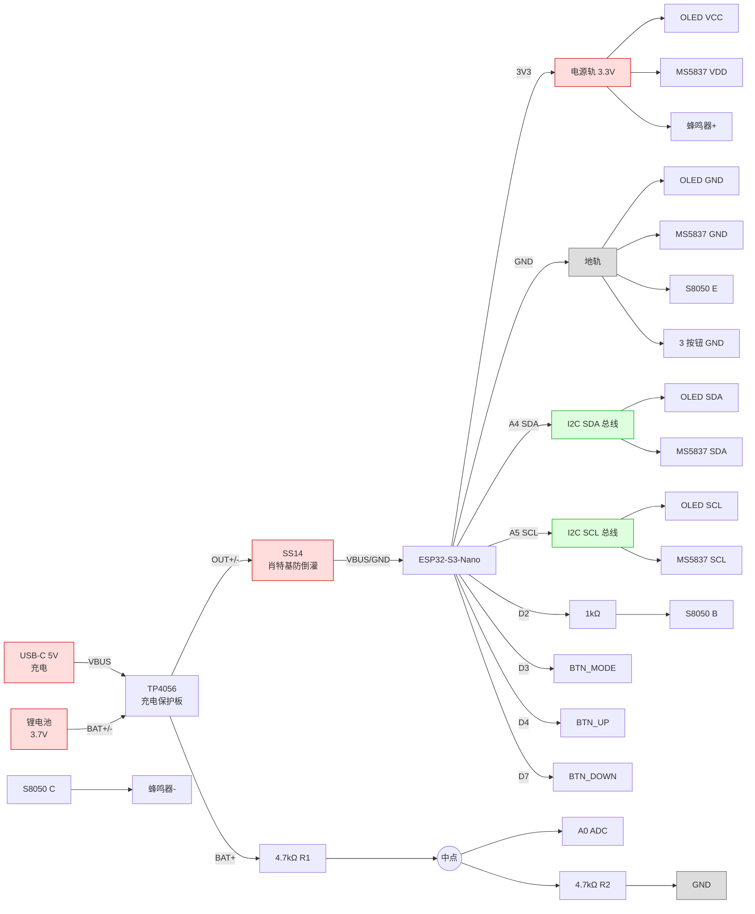
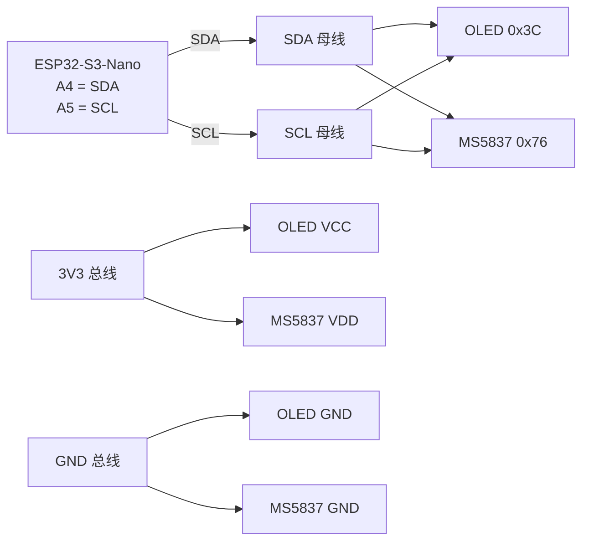
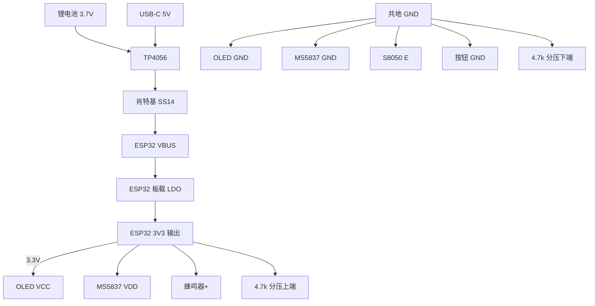
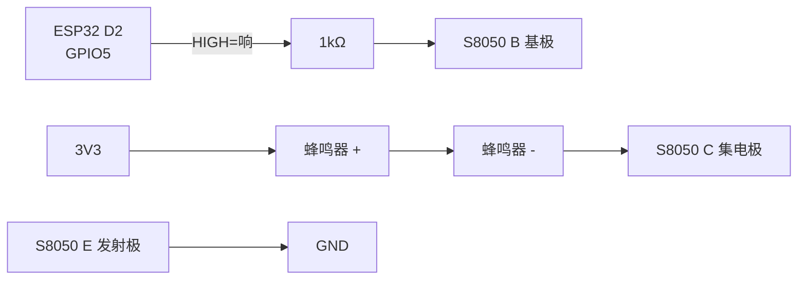

# DiveWatch 硬件接线文档

> ESP32-S3-Nano + MS5837-30BA + SH1106 OLED + 蜂鸣器 + 3 按钮 + 电池
> 适用版本: v2.9

## 元件清单 (BOM)

| 类别 | 元件 | 数量 | 说明 |
|------|------|------|------|
| 主控 | ESP32-S3-Nano | 1 | Arduino Nano 形态, USB-C |
| 传感器 | MS5837-30BA | 1 | 4-pin LCC, 30 bar 防水压力/温度 |
| 显示 | OLED SH1106 1.3" | 1 | 128×64, I²C, 4 针 |
| 报警 | 9042 有源蜂鸣器 | 1 | 3-5V |
| 三极管 | S8050 NPN | 1 | TO-92 封装 |
| 按钮 | 4-pin 轻触按键 6×6mm | 3 | MODE/UP/DOWN |
| 电源 | TP4056 充电保护板 | 1 | 带 DW01+FS8205 保护 |
| 电池 | 锂电池 3.7V | 1 | 1000-3000mAh 任意 |
| 电阻 | 1 kΩ | 1 | 蜂鸣器基极限流 |
| 电阻 | 4.7 kΩ | 2 | 电池电压采集分压 |
| 电容 | 100 nF (104) | 1 | MS5837 去耦, 紧贴芯片 |
| 推荐 | 肖特基二极管 SS14 | 1 | USB+电池防倒灌 (可选) |
| 线缆 | USB-C 数据线 | 1+ | 充电+烧录 |
| 线缆 | 0.1mm 漆包线 | ~50cm | MS5837 飞线 |
| 线缆 | 杜邦线/单股软线 | 若干 | 模块连接 |

---

## ESP32-S3-Nano 引脚分配 (核心)

板子使用 Arduino Nano 形态, 引脚标 D# / A# 风格. 实际 GPIO 在括号内.

| 板子丝印 | 内部 GPIO | 用途 | 接到 |
|---|---|---|---|
| **3V3** | - | 3.3V 输出 | OLED VCC, MS5837 VDD, 蜂鸣器(+), 4.7k 分压上端 |
| **GND** | - | 地 | OLED GND, MS5837 GND, S8050 E, 按钮 GND, 4.7k 分压下端 |
| **VBUS** | - | 5V 输入 | TP4056 OUT+ (经肖特基) |
| **A0** | GPIO 1 | ADC | 4.7k 分压中点 (电池电压) |
| **A4** | GPIO 11 | I²C SDA | OLED SDA, MS5837 SDA |
| **A5** | GPIO 12 | I²C SCL | OLED SCL, MS5837 SCL |
| **D2** | GPIO 5 | 数字输出 | 1kΩ → S8050 基极 |
| **D3** | GPIO 6 | INPUT_PULLUP | BTN_MODE 一端 |
| **D4** | GPIO 7 | INPUT_PULLUP | BTN_UP 一端 |
| **D7** | GPIO 10 | INPUT_PULLUP | BTN_DOWN 一端 |

---

## 总览接线图 (Mermaid)



---

## 各模块详细接线

### 1. OLED SH1106 (4 针 I²C)

| OLED 引脚 (从左到右) | 接到 ESP32 |
|---|---|
| GND | GND |
| VCC | 3V3 |
| SCL | A5 |
| SDA | A4 |

I²C 地址: `0x3C`

### 2. MS5837-30BA (LCC 4 pad, 飞线)

```
       ●  ← Pin 1 标识点
   ┌────────────┐
   │ 1●  ●4    │
   │   ╔═════╗  │
   │   ║◯传感║  │
   │   ╚═════╝  │
   │ 2●  ●3    │
   └────────────┘

   Pin 1 (VDD)  → 3V3
   Pin 2 (GND)  → GND  (+ 100nF 电容跨到 VDD)
   Pin 3 (SCL)  → A5
   Pin 4 (SDA)  → A4
```

I²C 地址: `0x76`

**100nF 电容必装**: 跨在 VDD-GND 飞线最近处 (≤ 5mm), datasheet 强制要求.

### 3. 蜂鸣器电路 (S8050 + 1kΩ)

```
S8050 引脚识别 (平面朝你, 引脚朝下):
   E (左)   B (中)   C (右)

接线:
   ESP32 D2 ──[1kΩ]── S8050 B
                       S8050 E ── GND
                       S8050 C ── 蜂鸣器 (-)
                       蜂鸣器 (+) ── 3V3
```

### 4. 3 按钮 (4-pin 轻触, 必须接对角)

```
4-pin 按钮内部:
   ┌─────────────────┐
   ●1            ●2  │  ← 1-2 内部短接 (节点 A)
   │   ┌─┐           │
   │   │○│ 按键      │
   │   └─┘           │
   ●4            ●3  │  ← 4-3 内部短接 (节点 B)
   └─────────────────┘
   
按下: 节点 A 与 节点 B 短路

接线 (选对角): Pin 1 → GPIO,  Pin 3 → GND
              或  Pin 2 → GPIO,  Pin 4 → GND

★ 同一长边上的两针不能选 (永远短路!)
```

| 按钮 | GPIO 引脚 | 板子丝印 | 短按功能 | 长按功能 |
|---|---|---|---|---|
| MODE | GPIO 6 | D3 | 切换页面 | 校准水面气压 |
| UP | GPIO 7 | D4 | 重置最大深度 | 进入设置菜单 |
| DOWN | GPIO 10 | D7 | 重置潜水计时 | 进入时间编辑 (LOG 页则擦除日志) |

### 5. 电池 + TP4056 + 电压采集

```
TP4056 板:
   ┌──────────────────────────┐
   │  IN+/-     BAT+/-     OUT+/-  │
   │  USB 5V   电池正负     给负载   │
   └──────────────────────────┘

接线:
   电池 (+) → TP4056 BAT+
   电池 (-) → TP4056 BAT-
   TP4056 OUT+ → [SS14 肖特基] → ESP32 VBUS  (建议加二极管防倒灌)
   TP4056 OUT- → ESP32 GND

电池电压采集 (4.7k+4.7k 分压 1:2):
   TP4056 BAT+ ●─[4.7kΩ R1]─●─[4.7kΩ R2]─● GND
                              │
                              ▼
                          ESP32 A0 (GPIO1)

   电池满 4.2V → ADC 读 2.1V → 代码 ×2 → 4.20V → 100%
   电池空 3.3V → ADC 读 1.65V → 代码 ×2 → 3.30V → 0%
```

**TP4056 上的 USB-C** 用于充电 (插充电器/电脑). **ESP32 板上的 USB-C** 用于代码烧录和串口调试. 不要同时插两个 USB.

---

## I²C 总线汇总

OLED + MS5837 共享 ESP32 的 I²C 总线 (A4 SDA + A5 SCL):



I²C 上拉电阻 (4.7kΩ → 3V3): OLED 模块板自带, 不需要外加.

---

## 电源/地总线汇总



---

## 蜂鸣器驱动电路 (Mermaid)



---

## 完整针脚连接矩阵

| ESP32 引脚 | 接到 | 备注 |
|---|---|---|
| 3V3 | OLED VCC, MS5837 Pin 1, 蜂鸣器(+), 4.7k R1 上端 | 3.3V 共用 |
| GND | OLED GND, MS5837 Pin 2, S8050 E, 3 按钮 GND, 4.7k R2 下端 | 共地 |
| VBUS | TP4056 OUT+ (经 SS14) | 5V 输入 |
| A0 (GPIO 1) | 4.7k 分压中点 | 电池电压 ADC |
| A4 (GPIO 11) | OLED SDA + MS5837 Pin 4 | I²C 数据 |
| A5 (GPIO 12) | OLED SCL + MS5837 Pin 3 | I²C 时钟 |
| D2 (GPIO 5) | 1kΩ → S8050 B | 蜂鸣器控制 |
| D3 (GPIO 6) | 按钮1 一对角端 (另一端 GND) | MODE |
| D4 (GPIO 7) | 按钮2 一对角端 (另一端 GND) | UP |
| D7 (GPIO 10) | 按钮3 一对角端 (另一端 GND) | DOWN |

---

## 装配要点

1. **MS5837 飞线焊接**: 4 个 LCC 焊盘 + 100nF 电容必装. 累计加热 ≤ 30 秒, 烙铁不能碰中央传感器圆顶.
2. **按钮对角接法**: 4-pin 按钮选对角才有效, 同长边短路.
3. **I²C 共总线**: OLED 和 MS5837 共用一组 SDA/SCL, 都接 A4/A5.
4. **电池电压分压**: 必须加 4.7k+4.7k 分压, 直接接 4.2V 到 A0 会烧 GPIO.
5. **USB 互斥**: TP4056 的 USB-C (充电) 和 ESP32 的 USB-C (烧录/调试) 不能同时插, 否则 5V 双向冲突.
6. **加肖特基二极管 SS14** (强烈推荐): 接在 TP4056 OUT+ → ESP32 VBUS 之间, 防止 USB 5V 倒灌进电池.
7. **共地原则**: 所有 GND 必须互联, 包括电池负极, ESP32 GND, 所有外设 GND.

---

## 软件配置 (源码 DiveWatch.ino 顶部)

```cpp
#define I2C_SDA       11    // A4
#define I2C_SCL       12    // A5
#define BUZZER_PIN     5    // D2
#define BTN_MODE_PIN   6    // D3
#define BTN_UP_PIN     7    // D4
#define BTN_DOWN_PIN  10    // D7
#define BAT_ADC_PIN    1    // A0
static const float BAT_DIVIDER = 2.0f;  // 4.7k+4.7k 分压比
```

如果换不同阻值的分压电阻, 修改 `BAT_DIVIDER` (= R1+R2 / R2).

---

## 工作模式

| 场景 | USB-C 状态 | 行为 |
|---|---|---|
| 平时使用 | 不插 | 电池供电 (经 SS14 → VBUS), OLED + MS5837 + 蜂鸣器全部工作 |
| 充电 | 插 TP4056 USB-C | 红灯亮充电中, 充满后绿灯亮. 电池仍能供电 ESP32 |
| 调试 | 插 ESP32 USB-C | 串口通讯, 5V 经 ESP32 USB 直接供电. **拔电池或加 SS14 避免冲突** |

---

## 故障排查

| 现象 | 检查 |
|---|---|
| OLED 不亮 | I²C 接线 (A4/A5), VCC 3.3V (不能 5V) |
| OLED 显示但内容错乱 | 控制器型号 (代码用 SH1106, 0.96" OLED 通常 SSD1306) |
| MS5837 不识别 | 飞线焊接, 100nF 电容是否装 |
| 串口扫不到 0x76 | MS5837 引脚顺序错 (Pin 1 标识) |
| 深度永远 0 或乱跳 | `setModel(MS5837_30BA)` 是否设置 |
| 蜂鸣器声音很小 | 蜂鸣器(+) 接 5V (VBUS) 而不是 3V3 |
| 蜂鸣器接错 | S8050 BC 反了, 或 1kΩ 漏接 |
| 按钮无反应 | 4-pin 按钮接成同长边 (短路), 或对角找错 |
| 电池显示 0% | 分压电路接错或没接 |
| USB 接电池后无法连 | 装 SS14 肖特基或拔电池再插 USB |

---

## 版本

- v1.0: 基础 (深度+温度+蜂鸣)
- v2.0: ZHL-16C NDL + 安全停留 + 按钮 + 日志
- v2.1: 中文 UI + 屏保 + 统计页
- v2.2: NTP + 温度趋势 + 1.3 寸屏 UI
- v2.3: 设置菜单 + GB2312 字体
- v2.5: 气量监控 (Air Time)
- v2.7: 字体 chinese3 → gb2312 全集
- v2.8: 电池衰减记录 (24h 趋势 + 每次潜水电压)
- v2.9: NDL 计划器 + 保守度 + 海拔 + 平均深度 + 开机自检 + 低温报警 + 气量 bar 化
